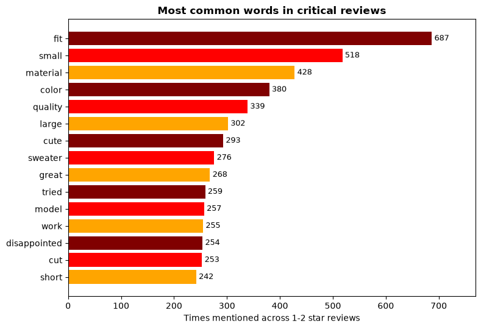
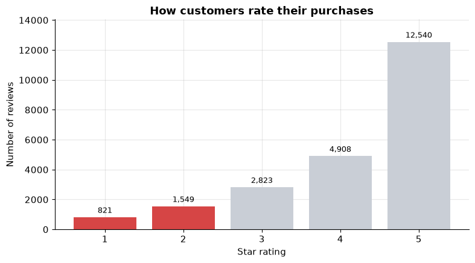
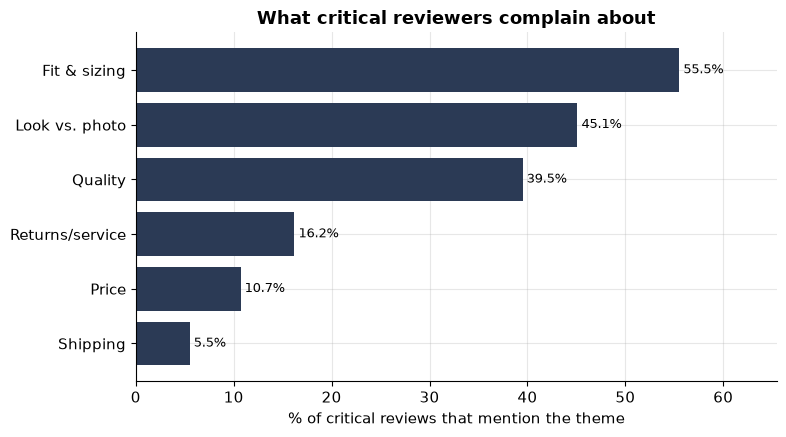

# 🧥 Customer Feedback Triage & Automated Replies

> Thousands of reviews come in every week. This project finds the angry ones automatically and drafts a warm, personal apology for each, so the support team can skim and send instead of writing every reply from scratch.

**Author:** Hiral Sarkar
**Assessment:** Imarticus Data Science Internship (Python Foundations & Gen AI)
**Everything lives in one notebook:** [`customer_feedback_analysis.ipynb`](customer_feedback_analysis.ipynb)

---

## 🎯 The problem, in one line

A retailer gets thousands of customer reviews a week and right now a human reads *all* of them by hand just to catch the unhappy ones and reply. That does not scale and the reviews that need the most attention are the easiest to lose in the pile.

So I built a small pipeline that does two slow jobs automatically:
1. **Find** the reviews that need a reply.
2. **Draft** the reply.

A person still gives each draft a quick read before it goes out. The goal is to save time, not replace the human touch.

> 🛍️ The data has no brand name (it was anonymised), but the reply emails need a shop to come from, so I invented one and called it **StyleNest**.

---

## 🧭 What the notebook does, start to finish

The notebook reads top to bottom like a story. Each step feeds the next:

| Step | What happens | How |
|------|--------------|-----|
| **1. Clean** | Fix missing values, tidy the text | pandas + basic string work |
| **2. Explore** | See how ratings are spread and where the bad ones cluster | 2 charts |
| **3. Filter** | Pull out the "critical" (1-2 star) reviews | a simple rule, no ML |
| **4. Understand** | Find the words, phrases and themes people complain about | `collections.Counter` |
| **5. Prioritise** | Pick the 3 most urgent reviews to answer first | a plain ranking rule |
| **6. Reply** | Draft a personal apology for each | a free LLM via OpenRouter |


---

## 🗂️ What's in this folder

```
📁 Imarticus Internship
├── 📓 customer_feedback_analysis.ipynb          ← the whole project (run this)
├── 📄 README.md                                 ← you are here
├── 📊 Womens Clothing E-Commerce Reviews.csv    ← the data (~23k reviews)
└── 📁 emails/                                    ← the 3 AI replies, saved as Word docs
```

One notebook, one readme, one data file, and the Word-doc replies the notebook writes out.

---

## 🚀 How to run it

You need **Python 3.9+**, **Jupyter**, and a few common libraries:

```bash
pip install pandas matplotlib requests python-docx
```

Then open the notebook and run every cell, top to bottom (Run All Cells).
It finishes in a couple of minutes. The data file is already in the same folder, so there is nothing to download or move.

---

## 🔑 The AI part and the API key

The reply-drafting uses **[OpenRouter](https://openrouter.ai/keys)**, which lets you reach lots of models through one simple endpoint. I use a **free** model, so it costs nothing to run.

The key sits in a plain variable near the top of Section 7:

```python
API_KEY = "PASTE-YOUR-OPENROUTER-KEY-HERE"
```

Grab a free key at <https://openrouter.ai/keys> and paste it over that placeholder to run the Gen AI part yourself. You do not need one just to read the results: the three replies are already saved in the notebook's output and in the `emails/` folder as Word documents.

> ⚙️ Free models get briefly busy and return "rate limited" errors. To handle that, the code keeps a short list of free models and quietly tries the next one, waiting a moment between attempts, instead of giving up on the first busy response.

---

## 🧹 How I cleaned the data

The only column I truly need is **Review Text**. If it is empty, the review is useless, so I drop those rows (about 845 of them, roughly 3.6% of the data) and move on. The other small gaps, like a missing title or category, are harmless, so I leave them.

Then I made a cleaned copy of the review text: lowercase, no punctuation or numbers, tidy spacing. This is only for counting words, so "Great!" and "great" count as the same thing. The **original wording is kept untouched** because I need it later to write the emails.

---

## 🔍 How the "find the complaints" logic works

No models here, just rules and string logic:

- **Critical review = 1 or 2 stars.** One boolean filter. Simple on purpose.
- **Top words:** split the text, remove a short **hand-written stopword list**, and count what's left with `Counter`. My first count was full of filler like "like" and "back", so I kept growing the stopword list until the words that remained actually meant something.
- **Top phrases:** the same idea for two-word pairs, but this time I *keep* small words like "too" and "not", because "too small" and "not worth" are the whole point.
- **Themes:** I grouped the common words into six buckets by hand (fit, quality, price, and so on) and counted how many critical reviews fall into each.

<p align="center"></p>

---

## 📊 What the data showed

Most customers are happy - the 1 and 2 star reviews (in red) are a clear minority, which is exactly why automating just that slice makes sense:

<p align="center"></p>

A few clear takeaways:

| Finding | Number |
|---------|--------|
| Reviews that are critical (1-2 star) | **~10%** (2,370 of 22,641) |
| Biggest complaint theme | **Fit & sizing** (55% of critical reviews) |
| Runner-up themes | Look-vs-photo (45%), Quality (40%) |
| Top phrases | *"not flattering", "too big", "see through", "too short", "very thin"* |

<p align="center"></p>

> 💡 The big story: complaints cluster hard around **fit** and **quality**, the two things you genuinely cannot judge from a product photo. That points the buying team at a real, fixable problem, not just "customers are unhappy."

---

## 🤖 The automated replies

For the three most urgent reviews (lowest rated, detailed, and upvoted by other shoppers), the notebook asks the model to write a short apology that:

- opens with real empathy,
- names the **specific** problem the customer mentioned,
- takes responsibility, and
- offers one clear next step (a refund or a replacement).

The drafts come out genuinely personal. They mention the actual issue instead of a generic "sorry for your experience", which is exactly what makes them worth sending. Each one is also saved as a ready-to-edit **Word document** in the `emails/` folder, so an agent can open it, tweak a line, and send.

---

*Built by **Hiral Sarkar** for the Imarticus Data Science Internship assessment.*
